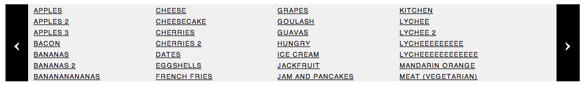

# rotatingnav

[](https://travis-ci.org/audreyr/rotatingnav)
[](https://david-dm.org/audreyr/rotatingnav.png)

A nav menu that rotates through infinite links, allowing for more nav menu links than can normally fit.



The above is just a screenshot. For a live demo, see http://bl.ocks.org/audreyr/6151852. In the demo:

* To advance forward: click > or press f
* To go backward: click < or press b

This will be going into the new djangopackages.com and OpenComparison framework soon. Stay tuned.

### Usage

Add this bit of JS:

```
$(function() {
	$(".rotatingnav").rotatingnav({
    panelCount: 8,
    activeCount: 4
	});
});
```

As for the corresponding HTML, see [demo/index.html](https://github.com/audreyr/rotatingnav/blob/master/demo/index.html) for an example of how to define the HTML for a nav menu with tons and tons of links.

### License

MIT. http://audreyr.mit-license.org
